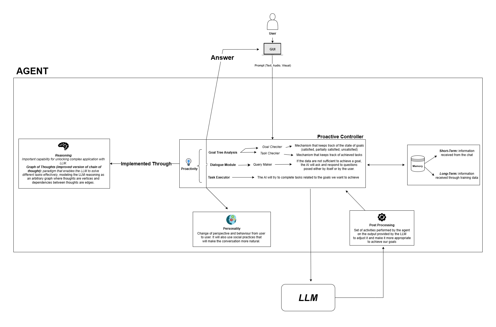
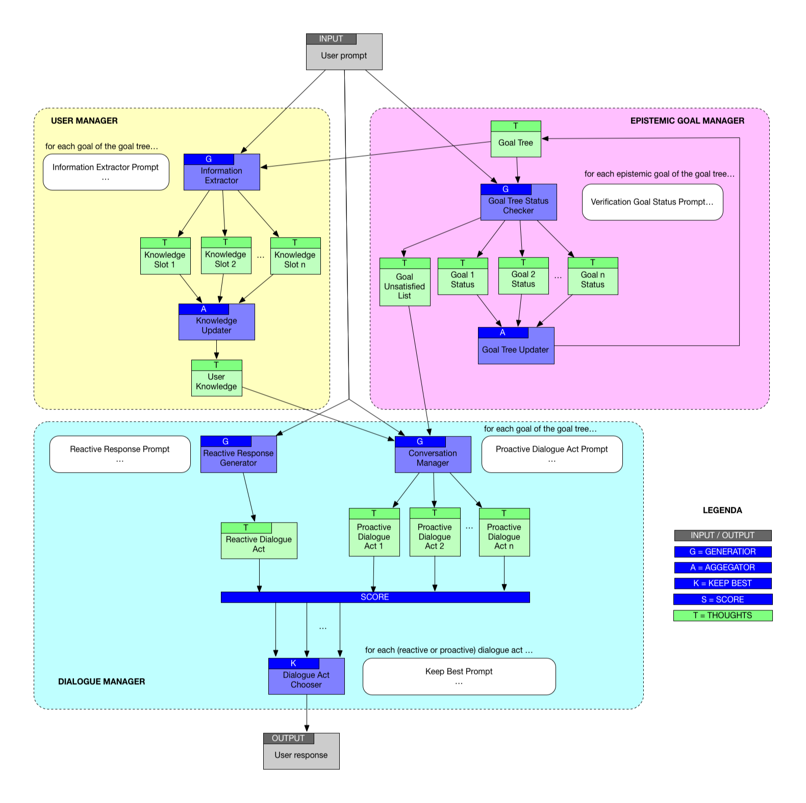
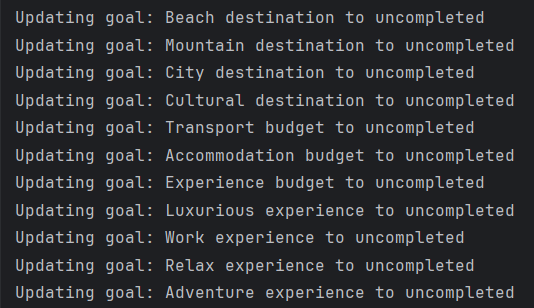

# MIRA - Motivational Intelligent Responsive Agent

Mira is a project developed by intern students from the University of Palermo at the Institute for High Performance Computing and Networking of the Italian National Research Council. It is based on the proactive and reactive querying of LLMs to achieve a specific goal represented by the 'root_goal' in the 'goal_tree' structure. To accomplish this, the work draws inspiration from the research conducted by Besta, Blach, et al. on the 'Graph of Thoughts' paradigm.

## Table of Contents
- [Overview](#overview)
- [Installation](#installation)
- [Usage](#usage)
- [Example](#example)
- [References](#references)

## Overview

Below, we show the structure of MIRA through two key images:

<h2 align="center"><b>MIRA's Architecture</b></h2>

<p align="center">
  
</p>

<h2 align="center"><b>MIRA's Graph of Thoughts</b></h2>

<p align="center">
  
</p>

<h2 align="center"><b>MIRA's Goal Tree</b></h2>

```json
   {
  "goals": [
    {
      "goal_id": "root",
      "goal_type": "FinalGoal",
      "goal_name": "Goal_name",
      "description": "The question the LLM asks itself to understand the user's need.",
      "status": "completed - uncompleted",
      "information": "The information gathered from the user's prompt",
      "score": "high - medium - low",
      "children": [
        {
          "goal_id": "goal",
          "goal_type": "CompositeGoal (Its satisfaction is related to the satisfaction of its children)",
          "goal_link": "AND - OR (AND if the satisfaction of the parent goal strictly depends on the satisfaction of this goal, OR if the satisfaction of the parent goal does not strictly depends on the satisfaction of this goal).",
          "goal_name": "goal",
          "description": "goal_description",
          "status": "completed - uncompleted",
          "score": "goal_score",
          "information": "goal_information",
          "children": [
            {
              "goal_id": "sub_goal",
              "goal_type": "EpistemicGoal - QualityGoal (EpistemicGoal represent a goal that enhances our knowledge of that specific field. QualityGoal represent a goal that refers to a specific type of goal that focuses on the quality or standard of the outcome, rather than just achieving a functional or objective result).",
              "goal_link": "AND - OR (AND if the satisfaction of the parent goal strictly depends on the satisfaction of this goal, OR if the satisfaction of the parent goal does not strictly depends on the satisfaction of this goal).",
              "goal_name": "sub_goal",
              "description": "sub_goal_description",
              "status": "completed - uncompleted",
              "score": "sub_goal_score",
              "information": "sub_goal_information"
            }
          ]
        }
      ]
    }
  ]
}
```

<h3 align="left"><b>`Reactive Response Prompt`</b></h3>

```
Your name is {prompt_data['name']}
You are {prompt_data['conversation_prompt']}.
Your task is to analyze the user's requests, understand them, and provide the best response.
Follow these personality and response style expectations: {prompt_data['personality']} and {prompt_data['social_practice']}.
Always respond in {prompt_data['language']}, regardless of input language.
```

<h3 align="left"><b>`Verification Goal Status Prompt`</b></h3>

```
Your task is to evaluate whether the {user_prompt} explicitly mentions, refers to, or negates the goal named '{goal['goal_name']}'.
### Stricter Evaluation Rules:
1. **Mark as 'completed'** only if all of the following conditions are met:
   - The goal '{goal['goal_name']}' is explicitly mentioned in {user_prompt} using the exact term, precise synonyms, or clearly equivalent and unambiguous descriptions.
   - OR the goal is explicitly negated (e.g., 'I don’t want {goal['goal_name']}') with clear and direct language.
   - The reference to the goal must be specific and leave no room for interpretation.
   - There is no ambiguity, vagueness, or partial mention of the goal.
2. **Mark as 'uncompleted'** if any of the following are true:
   - The {user_prompt} does not clearly and explicitly mention, describe, or negate the goal '{goal['goal_name']}'.
   - The {user_prompt} only partially mentions or vaguely references the goal, leaving room for interpretation.
   - The {user_prompt} is unrelated, ambiguous, or generic, even if it hints at the goal without being specific.
   - The {user_prompt} includes broad or generic statements without sufficient detail to confirm alignment with '{goal['goal_name']}'.
### Response Format:
- Respond with exactly one of the following:
  `completed`: if the goal is explicitly and unambiguously mentioned, described, or negated.
  `uncompleted`: if the goal is not explicitly mentioned, described, or negated, or if there is any ambiguity.
### Examples:
- **Example 1 (Explicit Confirmation):** {prompt_data['goal_tree_analyzer_positive_example']}
  **Output:** completed
- **Example 2 (Ambiguity or Irrelevance):** {prompt_data['goal_tree_analyzer_negative_example']}
  **Output:** uncompleted
### Notes:
- Treat ambiguous, generic, or partial mentions as 'uncompleted.'
- Negations must explicitly and directly reference the goal to qualify as 'completed.'
- Do not infer intent or meaning beyond the explicit text in {user_prompt}.
- Output only 'completed' or 'uncompleted'—no other text or characters.
```
<h3 align="left"><b>`Information Extractor Prompt`</b></h3>

 ```
 Your task is to identify text in {user_prompt} that mentions or refers to the goal named {goal['goal_name']}.
  Rules:
  1.Consider the goal **mentioned** if it appears exactly as {goal['goal_name']}, or if its concept is expressed through synonyms, definitions, or equivalent descriptions.
  2.Ignore content unrelated to {goal['goal_name']}. Do not consider other goals unless explicitly related.
  3.Respond with the following format:
  'The user wants to' followed by your output if {goal['goal_name']} is mentioned.
  'not mentioned' if {goal['goal_name']} is not mentioned.
  4.Do **not** provide explanations or additional text.
  Example: {prompt_data['goal_tree_analyzer_prompt_2']}.
  Follow these rules strictly for accurate output.
```

<h3 align="left"><b>`Proactive Dialogue Act Prompt`</b></h3>

 ```
Your task is to carefully analyze the user's input {user_prompt} and focus exclusively on identifying, using your related information {goal['information']}, the specific request related to {goal['goal_name']}.
  Your primary objective is to address or clarify any aspects of the {goal['goal_name']} in detail.
  Based on the content of the user's input, you must take one of the following approaches:
  1) Provide a clear and accurate response to the user's potential question related to {goal['goal_name']}.
  2) If the input is unclear, ask a specific clarifying question to better understand the user's intent regarding {goal['goal_name']}.
  3) When appropriate, provide a hybrid response that combines an answer with a question to guide the user in revealing more details about {goal['goal_name']}.
  Your response must meet these criteria:
  - Be directly relevant to {goal['goal_name']} and avoid introducing any unrelated information.
  - Stay concise, focused, and actionable based on the user's input.
  - Avoid assumptions; base your response strictly on the content of {user_prompt} and only request clarification when necessary.
  - Ensure your response aligns with these specific guidelines: {prompt_data['query_maker_prompt']}.
  Additional Instructions:
  - Respond always in {prompt_data['language']}, regardless of the language of the input.
  - Follow these personality and response style expectations: {prompt_data['personality']} and {prompt_data['social_practice']}.
  Keep your focus sharp and your responses accurate to ensure clear and meaningful interactions.
  Please generate answers as short as you can.
   ```

<h3 align="left"><b>`Keep Best Prompt`</b></h3>

 ```
Evaluate the relevance of the {response} to the {user_prompt} in relation to the goal '{goal['goal_name']}' and its {goal['goal_type']}.
  ### Evaluation Rules:
  1. Focus on how the {response} aligns with the goal '{goal['goal_name']}'.
  2. Assign one of the following score levels based on relevance and depth:
     - **high**: The response directly addresses the goal, provides detailed alignment, and is clearly relevant.
     - **medium**: The response moderately addresses the goal, with some alignment but lacking full detail.
     - **low**: The response has minimal or no alignment with the goal, or is vague.
  ### Examples:
  - If the response explicitly mentions the goal and provides detailed support, assign 'high'.
  - If the response partially aligns but lacks clarity or depth, assign 'medium'.
  - If the response is unrelated, vague, or unclear, assign 'low'.
  ### Output Rules:
  Your output must be strictly one of the following words: 'high', 'medium', or 'low'.
  - **Do not include any punctuation marks, additional words, or symbols.**
  - Do not use any dots, ellipses, or extra characters in your output.
  - **Provide only the word**: 'high', 'medium', or 'low'.
  - Any deviation from this format will be treated as invalid.
 ```

## Installation

Steps to install and run the project:

1. Clone the repository:
   ```bash
   git clone https://github.com/ls-cnr/MIRA.git
   ```
2. Navigate to the project directory:
   ```bash
   cd ../src
   ```
3. Install dependencies:
   ```bash
   pip install -r requirements.txt
   ```
   
   ```bash
   pip install flask langchain
   ```
   
   **Note**: Ensure that Ollama is installed locally for the project to function correctly. You can download and configure it by following the instructions provided in the official Ollama documentation.


4. Ensure that the `json_docs` directory contains the necessary configuration files (`models.json`, `prompts.json`, etc.).


5. Start the application by running the script `main.py`:
   ```bash
   python main.py
   ```

# Usage

The project utilizes multiple modules to manage user goals, analyze conversations and generate queries. Below are details on how to interact with the system using the key scripts: `conversation.py`, `goal_tree_analyzer.py`, and `query_maker.py`:

1. `conversation.py`: Manages the conversation flow, maintaining chat history and goal tracking.
2. `goal_tree_analyzer.py`: Analyzes the user's input against a predefined goal tree.
3. `query_maker.py`: Generates proactive queries based on the goals in the goal tree.

In addition to these key scripts, there are others that introduce advanced functionalities that allow the main files to work at their best:
1. `goal_tree_utils.py`: Introduces functions of fundamental importance used throughout the project, mainly in `goal_tree_analyzer`.
2. `short_memory.py`: Contains key functions for the implementation of the short memory.
3. `chooser.py`: Defines the function that allows us to choose the most appropriate response to the user's prompt.
4. `index.html`: HTML file that introduces the GUI.

### 1. Conversation Flow with `conversation.py`

The `conversation.py` file is designed to handle the flow conversation, the user type the prompt and the LLM process the answer. 
Firstly it generates a reactive response, then pass the user prompt to the `query_maker` and return a response array that contains one response for every uncompleted goal.


### 2. Goal Tree Evaluation with `goal_tree_analyzer.py`

The `goal_tree_analyzer.py` evaluates the user's input in the context of the goal tree. It assigns statuses such as `completed` or `uncompleted` to the goals of the `goal_tree`, based on the information gathered from the user's input.

This script also allows us to write down useful information rescued from the `user_prompt` and to put them in our `goal_tree`.

<h3 align="left"><b>Typical debug output:</b></h3>

<p align="left">
  
</p>

### 3. Generating Queries and Establishing Priorities with `query_maker.py`

The `query_maker.py` script is responsible for generating *proactive queries*, storing *reactive queries*, and assigning them appropriate *priorities* based on the conversation. It uses *goal information* from the `goal_tree` to produce relevant queries based on the `user_prompt` and the current state of the conversation.

## Example
In the `json_docs` directory, there are two example files: `goal_tree.json` and `goal_tree_ex.json`.

Here we focus on the first one.

The `goal_tree.json` file contains the `goal_tree` structure, whose purpose is to book a trip on behalf of the user. The goal tree is structured as follows:

```json
{
  "goals": [
    {
      "goal_id": "root",
      "goal_type": "FinalGoal",
      "goal_name": "Sale trip success",
      "description": "The sale is considered successful if all goals are met (destination, budget, experience, duration)",
      "status": "uncompleted",
      "information": "",
      "score": "",
      "children": [
        {
          "goal_id": "location_goal",
          "goal_type": "EpistemicGoal",
          "goal_link": "AND",
          "goal_name": "Destination selection",
          "description": "Does the travel destination meet specific requirements?",
          "status": "uncompleted",
          "score": "",
          "information": "",
          "children": [
            {
              "goal_id": "beach_location",
              "goal_type": "EpistemicGoal",
              "goal_link": "OR",
              "goal_name": "Beach destination",
              "description": "Does the user want the destination to be a seaside location?",
              "status": "uncompleted",
              "score": "",
              "information": ""
            },
            {
              "goal_id": "mountain_location",
              "goal_type": "EpistemicGoal",
              "goal_link": "OR",
              "goal_name": "Mountain destination",
              "description": "Is the destination a mountain location?",
              "status": "uncompleted",
              "score": "",
              "information": ""
            },
            {
              "goal_id": "city_location",
              "goal_type": "EpistemicGoal",
              "goal_link": "OR",
              "goal_name": "City destination",
              "description": "Is the destination a city?",
              "status": "uncompleted",
              "score": "",
              "information": ""
            },
            {
              "goal_id": "cultural_location",
              "goal_type": "EpistemicGoal",
              "goal_link": "OR",
              "goal_name": "Cultural destination",
              "description": "Is the user interested in cultural locations, like museums or art galleries?",
              "status": "uncompleted",
              "score": "",
              "information": ""
            }
          ]
        },
        {
          "goal_id": "budget_goal",
          "goal_type": "EpistemicGoal",
          "goal_link": "AND",
          "goal_name": "Budget requirements",
          "description": "Must the trip cost remain within the planned budget?",
          "status": "uncompleted",
          "score": "",
          "information": "",
          "children": [
            {
              "goal_id": "transport_budget",
              "goal_type": "EpistemicGoal",
              "goal_link": "AND",
              "goal_name": "Transport budget",
              "description": "Can the cost of transportation be estimated?",
              "status": "uncompleted",
              "score": "",
              "information": ""
            },
            {
              "goal_id": "accomodation_budget",
              "goal_type": "EpistemicGoal",
              "goal_link": "AND",
              "goal_name": "Accommodation budget",
              "description": "Can the cost of accommodation (hotel/apartment) be estimated?",
              "status": "uncompleted",
              "score": "",
              "information": ""
            },
            {
              "goal_id": "experience_budget",
              "goal_type": "EpistemicGoal",
              "goal_link": "OR",
              "goal_name": "Experience budget",
              "description": "Can the cost of possible experiences (e.g., excursions, snorkeling, etc.) be estimated?",
              "status": "uncompleted",
              "score": "",
              "information": ""
            }
          ]
        },
        {
          "goal_id": "experience_goal",
          "goal_type": "QualityGoal",
          "goal_link": "AND",
          "goal_name": "Client experience",
          "description": "Can the trip offer various extras to the user?",
          "status": "uncompleted",
          "score": "",
          "information": "",
          "children": [
            {
              "goal_id": "luxury_experience",
              "goal_type": "EpistemicGoal",
              "goal_link": "OR",
              "goal_name": "Luxurious experience",
              "description": "Can a luxurious experience with high-quality services and accommodations be offered?",
              "status": "uncompleted",
              "score": "",
              "information": ""
            },
            {
              "goal_id": "work_experience",
              "goal_type": "EpistemicGoal",
              "goal_link": "OR",
              "goal_name": "Work experience",
              "description": "Can a work experience be offered to the user?",
              "status": "uncompleted",
              "score": "",
              "information": ""
            },
            {
              "goal_id": "relax_experience",
              "goal_type": "EpistemicGoal",
              "goal_link": "OR",
              "goal_name": "Relax experience",
              "description": "Can a relaxing experience be offered to the user?",
              "status": "uncompleted",
              "score": "",
              "information": ""
            },
            {
              "goal_id": "adventure_experience",
              "goal_type": "EpistemicGoal",
              "goal_link": "OR",
              "goal_name": "Adventure experience",
              "description": "Can the trip focus on adventure, with activities such as hiking or exploring?",
              "status": "uncompleted",
              "score": "",
              "information": ""
            }
          ]
        },
        {
          "goal_id": "duration_goal",
          "goal_type": "EpistemicGoal",
          "goal_link": "AND",
          "goal_name": "Travel length",
          "description": "Must the trip duration match the client's preferences?",
          "status": "uncompleted",
          "score": "",
          "information": "",
          "children": [
            {
              "goal_id": "short_duration",
              "goal_type": "EpistemicGoal",
              "goal_link": "OR",
              "goal_name": "Short trip",
              "description": "Should the trip last a short period (1-3 days)?",
              "status": "uncompleted",
              "score": "",
              "information": ""
            },
            {
              "goal_id": "medium_duration",
              "goal_type": "EpistemicGoal",
              "goal_link": "OR",
              "goal_name": "Medium trip",
              "description": "Should the trip last a medium period (4-6 days)?",
              "status": "uncompleted",
              "score": "",
              "information": ""
            },
            {
              "goal_id": "long_duration",
              "goal_type": "EpistemicGoal",
              "goal_link": "OR",
              "goal_name": "Long trip",
              "description": "Should the trip last a longer period (7+ days)?",
              "status": "uncompleted",
              "score": "",
              "information": ""
            }
          ]
        }
      ]
    }
  ]
}
```
The `prompts.json` file contains information such as the agent's personality, name, and examples to improve the understanding of the LLM.

Its structure is as follows:
```json
{
  "name": "'Mira'",
  "conversation_prompt": "an expert travel agent",
  "language": "English",
  "query_maker_prompt": "f\" - If {goal} is 'location', aim to clarify the exact destination the user has in mind. Ask for specific details such as city, country, or region.\"\n                    f\" - If {goal} is 'budget', inquire about the user's budget range for the trip. Ask for an estimated amount or range they are willing to spend.\"\n                    f\" - If {goal} is 'experience', probe to uncover what kind of activities the user is looking for, such as adventure sports (e.g., hiking, snorkeling, skiing), cultural experiences, or relaxation.\"\n                    f\" - If {goal} is 'duration', clarify the length of the trip the user is planning. Ask how many days or weeks they intend to travel.\"\n                    f\" Examples for {goal}:\"\n                    f\" - For {goal} 'location', ask: 'Where would you like to go?' or 'Which destination are you considering?'\"\n                    f\" - For {goal} 'budget', ask: 'What is your budget range for this trip?' or 'How much would you like to spend on this trip?'\"\n                    f\" - For {goal} 'experience', ask: 'What kind of activities or experiences are you interested in?' or 'Are you looking for something more adventurous, like hiking or diving?'\"\n                    f\" - For {goal} 'duration', ask: 'How long would you like your trip to be?' or 'What is the duration you are thinking of for your trip?'\"\n                    \" For 'experience', only respond if the message explicitly mentions activities like excursions, water sports, or similar experiences.\"\n",
  "goal_tree_analyzer_positive_example": "if user_prompt is 'I want to go to the beach with 200 euros.' and goal['goal_name'] is 'Beach destination', the response must be 'completed'. If user_prompt is 'I need 200 euros for my trip.' and goal['goal_name'] is 'Beach destination', the response must be 'uncompleted'.",
  "goal_tree_analyzer_negative_example": "if user_prompt is 'I don't want to go to the mountains.' and goal['goal_name'] is 'Mountain destination', the response must be 'completed'.",
  "goal_tree_analyzer_prompt_2": "If user_prompt is 'I want to go to the beach with 200 euros.' and goal['goal_name'] is 'Beach destination', the output must be something like 'The user wants to go to a beach location'.",
  "social_practice": "Act like the personality you resemble. Furthermore, say sometimes the user's name, **only if you know that**, do not try to recall it if you don't remember.",
  "personality": "A determined, kind woman"
}
```

To run the program to test this example, choose the LLM model from the `models.json` file and then run `main.py`.

## References

- Besta, Maciej, et al. "Graph of thoughts: Solving elaborate problems with large language models." Proceedings of the AAAI Conference on Artificial Intelligence. Vol. 38. No. 16. 2024.